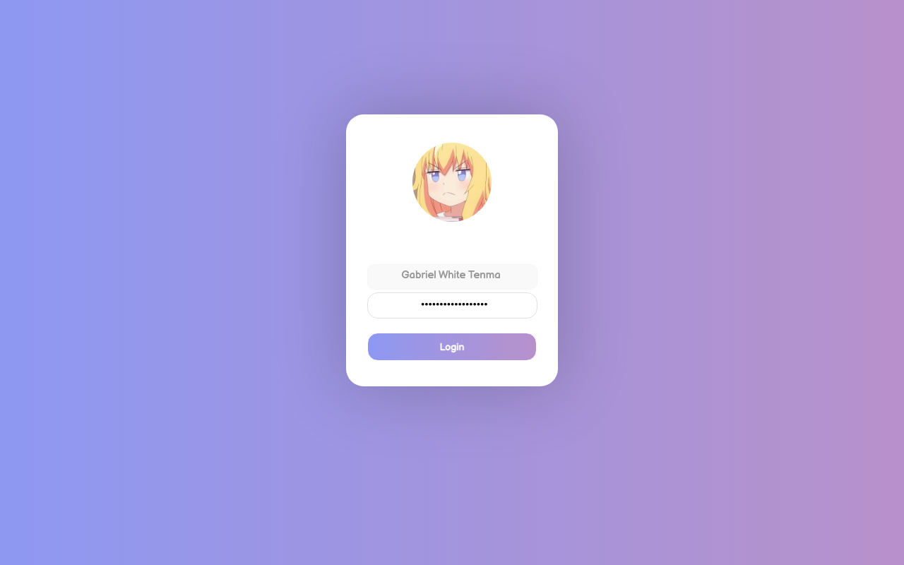

<div align="center">
  
</div>

LightDM-**weebkit** theme — Animated Background Gradient + Animated Button + Multi-account support.

## What is LightDM Webkit?

The `lightdm-webkit-greeter` lets you choose a background image directly on the login screen.  
This theme adds a smooth animated gradient background instead of a static image.

By default, images are sourced from `/usr/share/backgrounds`. You can change the background directory by editing `lightdm-webkit-greeter.conf`.

## Dependency required

- **lightdm-webkit-greeter** — https://github.com/JezerM/web-greeter

## Font required

- **Balsamiq** — already included (`static/Balsamiq_Sans/`)
- **Segoe UI** — optional https://github.com/meloncholy/mt-stats-viewer/raw/master/public/fonts/segoe-ui/segoeui.ttf
- **Iosevka** — optional https://github.com/be5invis/Iosevka/releases/download/v2.0.1/01-iosevka-2.0.1.zip

Or customize in `static/style.css`.

## Installation

```
1. Install lightdm and lightdm-webkit-greeter
    sudo apt install lightdm lightdm-webkit-greeter

2. In the terminal, navigate to /usr/share/lightdm-webkit/themes/

3. Clone this repository here, it should create a folder called lightdm-gab-gradient
    sudo git clone https://github.com/<your-username>/lightdm-gab-gradient.git

4. Enable the theme in your /etc/lightdm/lightdm-webkit-greeter.conf
    theme = lightdm-gab-gradient

5. Replace lightdm-gtk to lightdm-webkit in /usr/share/lightdm/lightdm.conf.d/60-lightdm-gtk-greeter.conf
    greeter-session = lightdm-webkit-greeter

6. Restart lightdm
    sudo systemctl restart lightdm
```

## Screenshot



## Modifying & Development

See [MOD.md](MOD.md) for how to customise the theme, run it locally during development, and how the code is structured.

MIT License.
